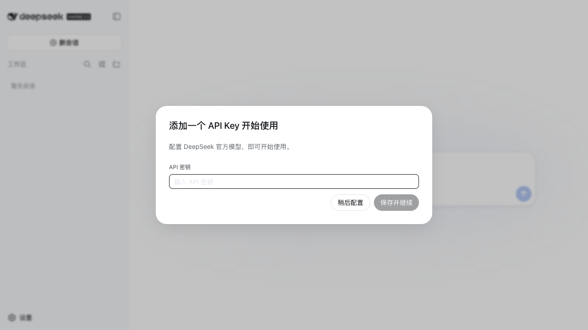
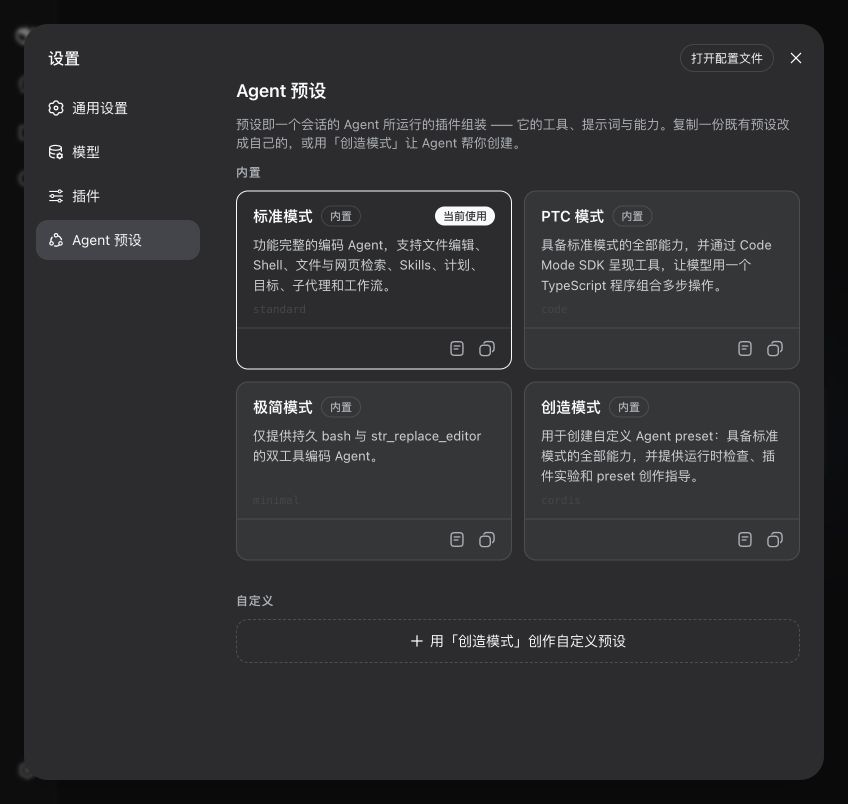
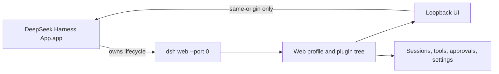

# `@deepseek-ai/dsh-desktop`

English | [中文](README.zh.md)

The macOS desktop distribution opens the existing DeepSeek Harness Web application in a hardened Electron window. It starts one private `dsh web --port 0` child process, waits for the CLI readiness line, and preserves the Web profile's UI, sessions, tools, approvals, settings, and plugin composition without maintaining a second frontend.



The first launch asks for a DeepSeek API key. The credential provider stores it under the normal Harness home with owner-only permissions; the key is not compiled into the application or repository.

The Settings dialog includes the complete Agent preset manager: the shipped Standard, PTC, Minimal, and Creator modes, read-only composition viewing, local preset copies, default selection, and the Creator-mode authoring entry.



## Quick start

1. Build the application with `pnpm run pack:desktop:mac`.
2. Open `apps/desktop/dist/DeepSeek Harness App-darwin-arm64/DeepSeek Harness App.app`.
3. Add a DeepSeek API key when prompted, choose a workspace, and start a session.

## Architecture



The Electron main process owns startup and shutdown, while the established Web profile remains the single GUI and Agent implementation. The desktop launch adds `desktop.cordis.yml`, which opens the SQLite session-query index on first search so conversation-content search works in the packaged application without changing the shared Web profile. This keeps the desktop experience visually and behaviorally aligned with the browser application.

## Build and development

Build every runtime artifact and open the desktop application:

```sh
pnpm run dev:desktop
```

Create an unpacked `.app` under `apps/desktop/dist/DeepSeek Harness App-darwin-arm64/`:

```sh
pnpm run pack:desktop:mac
```

The checked-in `assets/AppIcon.svg` is the source for the complete macOS iconset and `assets/icon.icns`; packaging embeds that icon as the application's `CFBundleIconFile`.

The application uses the user's home directory as the initial Harness working directory because Finder does not provide a meaningful process cwd. Set `DSH_DESKTOP_CWD` before launch to override it. The normal Harness home, credentials, settings, session persistence, sandbox, and approval behavior remain owned by the Web profile.

## Runtime behavior

The renderer has no Node integration, uses context isolation and the Chromium sandbox, and may navigate only within the assigned loopback origin. HTTP and HTTPS links outside that origin open in the system browser; other schemes are rejected. Application exit sends SIGTERM to Harness, waits up to eight seconds for plugin disposal, and then sends SIGKILL only if shutdown did not finish.

This distribution intentionally reuses the browser carrier. It is not the port-free Electron IPC carrier reserved by the GUI architecture; that carrier remains a separate future application-level transport.

## Known limitations

- The build is macOS-only and is not code-signed or notarized by the local packaging command.
- The packaged application launches the CLI through Electron's bundled Node runtime (`ELECTRON_RUN_AS_NODE`) with `--expose-internals`: the Cordis loader needs Node's internal ESM loader, and its native-addon fallback is ABI-incompatible with Electron. This is a pinned contract — an Electron or Node upgrade that reshapes the internal loader breaks packaged startup.
- A loopback HTTP server exists for the lifetime of the application, although the OS assigns a fresh port and the Web profile accepts only loopback by default.
- Closing the last window follows normal macOS behavior and keeps the application running until the user quits it.

## Model Experience

The model receives the same Web-surface context and `DSH_WEB_URL` value as `dsh web`; the desktop wrapper adds no model-visible prompt content.
