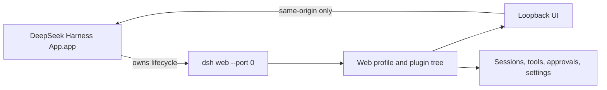

# `@deepseek-ai/dsh-desktop`

[English](README.md) | 中文

macOS 桌面发行版在经过安全加固的 Electron 窗口中打开现有 DeepSeek Harness Web 应用。它启动一个私有的 `dsh web --port 0` 子进程，等待 CLI（命令行界面）就绪行，并在不维护第二套前端的前提下保留 Web profile 的 UI、会话、工具、审批、设置和插件组合。


首次启动时，应用会提示添加 DeepSeek API Key。凭据 provider 会将密钥以仅当前用户可访问的权限存入常规 Harness 主目录；密钥不会被编译进应用或写入仓库。

“设置”对话框包含完整的 Agent 预设管理器：内置的标准、PTC、极简和创造模式，只读查看组合，复制本地预设，选择默认预设，以及通过创造模式创作预设的入口。


## 快速开始

1. 运行 `pnpm run pack:desktop:mac` 构建应用。
2. 打开 `apps/desktop/dist/DeepSeek Harness App-darwin-arm64/DeepSeek Harness App.app`。
3. 按提示添加 DeepSeek API Key、选择工作区并开始会话。

## 架构



Electron 主进程负责启动与关闭，现有 Web profile 仍是唯一的 GUI 和 Agent 实现。桌面启动会额外应用 `desktop.cordis.yml`，在首次搜索时打开 SQLite 会话查询索引，使打包应用可搜索对话正文，同时不改变共享 Web profile，因此桌面版可以持续与浏览器应用保持视觉和行为一致。

## 构建与开发

构建所有运行时产物并打开桌面应用：

```sh
pnpm run dev:desktop
```

在 `apps/desktop/dist/DeepSeek Harness App-darwin-arm64/` 下创建未打包的 `.app`：

```sh
pnpm run pack:desktop:mac
```

仓库中的 `assets/AppIcon.svg` 是完整 macOS iconset 与 `assets/icon.icns` 的源文件；打包时会将该图标嵌入为应用的 `CFBundleIconFile`。

应用使用用户主目录作为 Harness 的初始工作目录，因为 Finder 不会提供有意义的进程 cwd。启动前设置 `DSH_DESKTOP_CWD` 可覆盖该目录。常规 Harness 主目录、凭证、设置、会话持久化、沙箱和审批行为仍由 Web profile 负责。

## 运行时行为

渲染进程不启用 Node 集成，使用上下文隔离和 Chromium 沙箱，并且只能在分配的回环地址源内导航。该源之外的 HTTP 和 HTTPS 链接在系统浏览器中打开；其他协议会被拒绝。应用退出时先向 Harness 发送 SIGTERM，最多等待八秒让插件完成 dispose（资源释放），仅在关闭未完成时发送 SIGKILL。

该发行版有意复用浏览器承载层。它不是 GUI 架构预留的无端口 Electron IPC 载体；后者仍属于未来独立的应用层传输实现。

## 已知限制

- 当前构建仅支持 macOS，本地打包命令不会对应用进行代码签名或公证。
- 应用存活期间会运行一个回环 HTTP 服务器，但端口由 OS 临时分配，且 Web profile 默认只接受回环访问。
- 关闭最后一个窗口遵循常规 macOS 行为；应用会继续运行，直到用户主动退出。

## 模型体验

模型接收与 `dsh web` 相同的 Web 界面上下文和 `DSH_WEB_URL` 值；桌面包装层不会增加模型可见的提示词内容。
